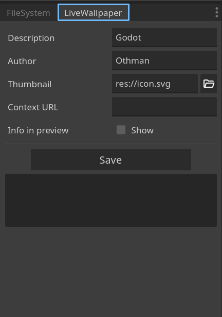

# Godot Android Live Wallpaper
Make your Godot Android application run in the background as a live wallpaper.

## How to setup
* Go to Project -> Project settings -> Plugins.
* Enable `LiveWallpaper` plugin.
* Go to Project then click Reload Current Project.
* Add `LiveWallpaper` node using the plus add-node button in the scene tab.

## How to use
Once the `LiveWallpaper` node has been added to the scene. You can:
* reference it from any script and start live wallpaper service by calling `start_live_wallpaper_service()` method
```
$LiveWallpaper.start_live_wallpaper_service()
```
* Connect to its signals by clicking connect from the Node tab. For example, connecting to signal visibility_changed(visibility:bool) to receive visibility updates, or from code as follows

```
$LiveWallpaper.visibility_changed.connect(is_user_viewing_my_wallpaper)
```
## Live Wallpaper settings

<p align="center">
  
</p>

A `LiveWallpaper` docked tab is going to show up next to Filesystem. From there you can set the wallpaper name and preview picture. The wallpaper name is going to show up in the live wallpaper picker, and the preview picture is going to show up as a thumbnail. Other metadata such as author and context URL are optional if you toggled show `Info In Preview` on.

## Known Issues
* Setting the app as a live wallpaper for the lock screen, home screen, or both will always set it to both in Android 14. A workaround is to set it manually from the device wallpaper settings.

* Samsung's One UI launcher is known to have issues with calling the [`onOffsetsChanged()`](https://developer.android.com/reference/android/service/wallpaperWallpaperService.Engine#onOffsetsChanged(float,%20float,%20float,%20float,%20int%20int)) callback. This problem has been observed on various Samsung devices across different Android versions for years, including older models like the Note 8 and newer ones like the Galaxy S23. As a result, the signals `homescreen_count_updated` and `on_offsets_changed` do not function properly on stock Samsung launchers. A potential workaround is to download [`Pixel Launcher`](https://play.google.com/store/search?q=pixel+launcher&c=apps&hl=en), which is what I'm using, or [`Smart Launcher 6`](https://play.google.com/store/apps/details?id=ginlemon.flowerfree). These launchers (or any other third-party launchers available on the Play Store) should work fine with home screen signals.
Samsung heavily customizes Android, including the launcher, which can interfere with certain system callbacks. In a production context, asking the end user to switch launchers just for the scrolling signals to work as intended is not ideal. Therefore, I recommend emulating home screen scrolling using Godot's touch input functions.


## Important Considerations:

* The plugin will attempt to run your entire Godot application as a background live wallpaper, including handling all touch inputs. Therefore, ensure you query the is_live_wallpaper() function to delete or limit frame rate and free resources that are not essential to the live wallpaper process, such as UI elements.

* The plugin runs in the background, so be mindful of memory usage and power consumption once your app starts running as a live wallpaper. The plugin provides callback signals such as 'trim_memory' and 'visibility_changed'. Although the app pauses when it is no longer visible, ensure that you do not run intensive tasks when it becomes visible again.

