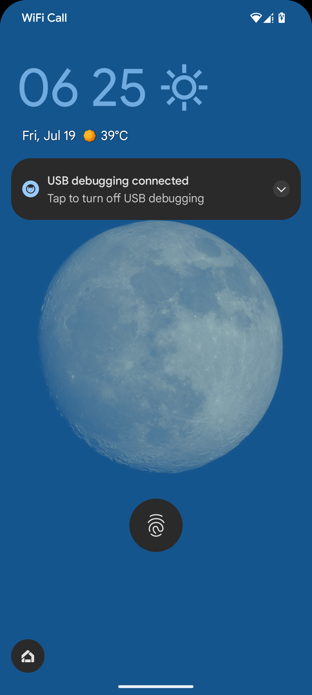
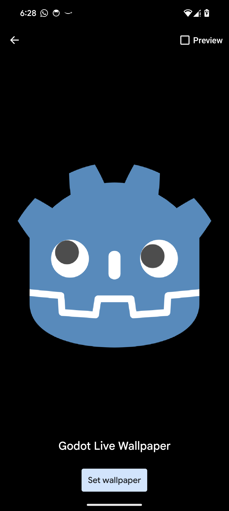

<p align="center">
  
  
</p>
<p align="center" style="color: #888888; font-size: small;">
  The Moon Application (<a href="https://play.google.com/store/apps/details?id=com.oproject.themoon" style="color: #888888;">Android</a>, <a href="https://apps.apple.com/app/the-moon-simulation/id6526486262" style="color: #888888;">iOS</a>)
</p>


# Godot Android Live Wallpaper
Make your Godot Android application run in the background as a live wallpaper. To download the release, ready to use plugin files go to the [`Release`](https://github.com/TheOathMan/Godot-Android-Live-Wallpaper/releases) section. To learn more about Godot Android Live Wallpaper, read more. 

This project template is from [`Android Plugin Template`](https://github.com/m4gr3d/Godot-Android-Plugin-Template). Also see [`Creating Android plugins`](https://docs.godotengine.org/en/4.0/tutorials/platform/android/android_plugin.html) for more details about godot plugins for android.

## How to setup
* Extract `GodotLiveWallpaperPlugin.zip` file.
* Drag the`addons` folder to your project folder's `res://` root folder.
* Go to Project -> Project settings -> Plugins.
* Enable `LiveWallpaper` plugin.
* Go to Project then click Reload Current Project.
* Add `LiveWallpaper` node using the plus add-node button in the scene tab.

## How to use
Once the `LiveWallpaper` node has been added to the scene. You can:
* reference it from any script and start live wallpaper service by calling `start_live_wallpaper_service()` method
```
$LiveWallpaper.start_live_wallpaper_service()
```
* Connect to its signals by clicking connect from the Node tab. For example, connecting to signal visibility_changed(visibility:bool) to receive visibility updates, or from code as follows

```
$LiveWallpaper.visibility_changed.connect(is_user_viewing_my_wallpaper)
```

## Building the plugin
You might want to build the plugin yourself to set wallpaper name and preview picture. To build the plugin:

- Open the terminal in the project's root directory, and run this command:
```
compile "Wallpaper Name" "path/to/your/thumbnail.png"
```
- Make sure the thumbnail is in PNG format and its filename contains only lowercase letters with no spaces or numbers.

- If everything goes as expected, static debug and release libraries will be compiled into the `plugin/addons/LiveWallpaper/bin` folder. After that, copy this `addons` folder into your Godot project folder, and enable the plugin.

## Known Issues
* Setting the app as a live wallpaper for the lock screen, home screen, or both will always set it to both in Android 14. A workaround is to set it manually from the device wallpaper settings.

* Samsung's One UI launcher is known to have issues with calling the [`onOffsetsChanged()`](https://developer.android.com/reference/android/service/wallpaperWallpaperService.Engine#onOffsetsChanged(float,%20float,%20float,%20float,%20int%20int)) callback. This problem has been observed on various Samsung devices across different Android versions for years, including older models like the Note 8 and newer ones like the Galaxy S23. As a result, the signals `homescreen_count_updated` and `on_offsets_changed` do not function properly on stock Samsung launchers. A potential workaround is to download [`Pixel Launcher`](https://play.google.com/store/search?q=pixel+launcher&c=apps&hl=en), which is what I'm using, or [`Smart Launcher 6`](https://play.google.com/store/apps/details?id=ginlemon.flowerfree). These launchers (or any other third-party launchers available on the Play Store) should work fine with home screen signals.
Samsung heavily customizes Android, including the launcher, which can interfere with certain system callbacks. In a production context, asking the end user to switch launchers just for the scrolling signals to work as intended is not ideal. Therefore, I recommend emulating home screen scrolling using Godot's touch input functions.


## Important Considerations:

* The plugin will attempt to run your entire Godot application as a background live wallpaper, including handling all touch inputs. Therefore, ensure you query the is_live_wallpaper() function to delete or limit frame rate and free resources that are not essential to the live wallpaper process, such as UI elements. Check the sample project in the [`release`](https://github.com/TheOathMan/Godot-Android-Live-Wallpaper/releases) section for a working implementation of this.

* The plugin runs in the background, so be mindful of memory usage and power consumption once your app starts running as a live wallpaper. The plugin provides callback signals such as 'trim_memory' and 'visibility_changed'. Although the app pauses when it is no longer visible, ensure that you do not run intensive tasks when it becomes visible again.

